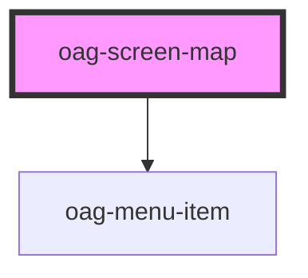

# oag-screen-map

<!-- Auto Generated Below -->

## Properties

| Property            | Attribute             | Description | Type                                            | Default        |
| ------------------- | --------------------- | ----------- | ----------------------------------------------- | -------------- |
| `backgroundLayer`   | `background-layer`    |             | `"grau" \| "orthophoto" \| "osm" \| "standard"` | `'orthophoto'` |
| `disableTouchClass` | `disable-touch-class` |             | `boolean`                                       | `true`         |
| `visible`           | `visible`             |             | `"init" \| boolean`                             | `'init'`       |

## Events

| Event      | Description | Type               |
| ---------- | ----------- | ------------------ |
| `readyMap` |             | `CustomEvent<Map>` |

## Dependencies

### Depends on

- [oag-menu-item](../oag-menu-item)

### Graph

----------------------------------------------

*Built with [StencilJS](https://stenciljs.com/)*
